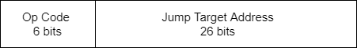
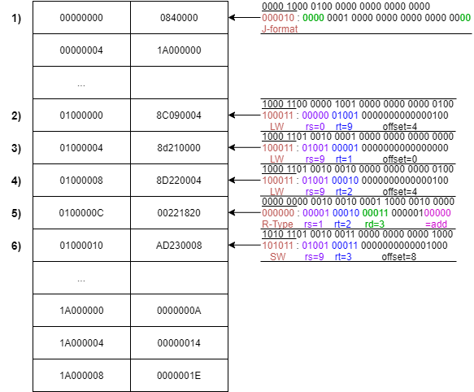

# Summary Report for CN210 : Computer Architecture
> หน้าเพจนี้จัดทำขึ้นเพื่อรวมรวมและสรุปเนื้อหาจากวิชา CN210 Computer Architecture ประจำปีการศึกษาที่ 2/2562

________________________________________________________________________________________________________________________________________

## HomeWork#1 - Jump Format (J-Format)

* **คลิปวีดีโอของการบ้านครั้งที่1**
> [Click Here for HomeWork#1 video](https://youtu.be/37fsqcEbHfk)

* **คำอธิบายเกี่ยวกับการบ้านครั้งที่1**


**Jump Format** มี 2 ส่วน



  ได้แก่
  1. **Op Code (Operation Code)** : มีความยาว *6 bits* และ สำหรับ J-Format จะใช้ Op Code คือ `000010`
  2. **Address (Jump Target Address)** : มีความยาว *26 bits* 
    * Note : ที่จริงแล้วใน สถาปัตยกรรมแบบ MIPs รหัสคำสั่งจะมีความยาว *32 bits* แต่จะต้องนำมาทำเป็น *26 bits* เพื่อใช้เป็น Address
________________________________________________________________________________________________________________________________________

**วิธีการแปลง *32 bits* เป็น *26 bits***

  เพื่อที่จะเข้าใจได้ง่ายขึ้นจึงยก**ตัวอย่าง**ประกอบการอธิบาย ดังนี้

  คำสั่ง `j 0xD0200080`  `pc=0xd0000040`  `opcode j=000010`

  นำ `D0200080` มาเขียนเป็น *เลขฐานสอง* จะได้ว่า

```
D0200080 = 1101 0000 0010 0000 0000 0000 1000 0000     //4บิตแรก(1101) และ 2บิตท้าย(00)ออก

         = 0000 1000 0000 1000 0000 0000 0010 0000     //ใส่opcode = 000010 ไปด้านหน้า
         
         = 0x0808020    //นำเลขฐาน2มาเปลี่ยนเป็นเลขฐาน16
```

**Note1 :** เหตุผลที่ทำการตัด4บิตแรก และ 2บิตท้ายออก คือ
1. ในMIPS Arcitechture มีรหัสความยาว *32 bits* หรือ *4 bytes* ซึ่งจะเป็น 4 เท่าไปเรื่อยๆ จึงทำให้ **2บิตท้ายของรหัส จะเป็น 00 เสมอ** จึงสามารถตัดออกได้
2. ใน4บิตแรก คือ **เลขที่มีนัยสำคัญสูงสุด** ซึ่งมีโอกาสน้อยมาที่ค่าจะเปลี่ยน จึงทำให้ 4บิตแรกของรหัส สามารถตัดออกได้

**Note2 :** เหตุผลที่เปลี่ยนเลขฐาน2 เป็นเลขฐาน16 คือ เพื่อการอ่านที่ง่ายกว่า

________________________________________________________________________________________________________________________________________


## HomeWork#2 - การทำงานของ CPU

* **คลิปวีดีโอของการบ้านครั้งที่2**
> [Click Here for HomeWork#2 video](https://youtu.be/GqOXGPJogCU)

* **คำอธิบายเกี่ยวกับการบ้านครั้งที่2**

   ยกตัวอย่าง ด้วยโค้ด `Test.java` ดังนี้
   ```java
   public class Test{
      public static void main(String[] args){
      int a = 10;
      int b = 20;
      int c = a + b;
      }
   }
   ```
   
   
   
**อธิบายการทำงานของ CPU**
   
**1.** CPU จะเริ่มทำงานที่ตำแหน่งที่ 0 (หรือ 00000000) ในตำแหน่งที่0 จะมีคำสั่ง 0840000 อยู่ เราจะนำมาเขียนเป็น เลขฐาน2 ได้ดังนี้
   ```
   0840000 = 0000 1000 0100 0000 0000 0000 0000
   ```
   
   และCPU จะเข้าไปดู 6บิตแรก ซึ่งก็คือ opcode ทำให้เรารู้ว่ารหัสนี้เป็นคำสั่งอะไร ซึ่งได้ออกมาเป็น 000010 เป็นคำสั่ง Jump
   
   จากนั้นนำเลขที่เหลือด้านหลังมาเติม 0000 เข้าไปด้านหน้า และ 00 ต่อท้าย ได้ดังนี้
   ```
   0000 0001 0000 0000 0000 0000 0000
   ```
   นำเลขฐาน2ที่ได้มา มาเขียนเป็นเลขฐาน16 ได้ดังนี้ `0100000`
   
   ทำให้ CPU รู้ว่า Address ที่จะกระโดดไปทำงานต่อไปคือที่ตำแหน่ง 01000000
   
   ________________________________________________________________________________________________________________________________
   
**2.** CPU กระโดดมาทำงานในตำแหน่งที่ 01000000 ในตำแหน่งนี้มีคำสั่ง 8C090004 อยู่ ทำเป็นเลขฐาน2 ได้ดังนี้
   ```
   8C090004 = 1000 1100 0000 1001 0000 0000 0000 0100
   ```
   
   และCPU จะเข้าไปดู opcode ที่6บิตแรก ซึ่งก็คือ 100011 เป็นคำสั่ง LW (หรือ Load Word)
   
   จากนั้นจะเข้าไปดู 5บิตถัดไป คือ 00000 ซึ่งก็คือ rs = 0 และ 01001 ซึ่งก็คือ rt = 9
   
   และสุดท้ายคือ ส่วนที่เหลือ คือ 0000000000000100 ซึ่งก็คือ offset = 4
   
   คำสั่งload word จะทำการ ดึงข้อมูลจาก register ที่ rs+offset = 0+4 = 4 ซึ่งก็คือไปนำข้อมูลมาจากตำแหน่ง 00000004 
   
   ไปเก็บใน register ที่ 9 หรือ 1A000000
   ________________________________________________________________________________________________________________________________
   
   **3.** CPU ลงมาทำงานในตำแหน่งต่อไป คือตำแหน่งที่ 01000004 ในตำแหน่งนี้มีคำสั่ง 8d210000 อยู่ ทำเป็นเลขฐาน2 ได้ดังนี้
    ```
    8d210000 = 1000 1101 0010 0001 0000 0000 0000 0000
    ```
    
   และCPU เข้าไปดู opcode ที่6บิตแรก ซึ่งก็คือ 100011 เป็นคำสั่ง LW (หรือ Load Word)
   
   จากนั้นจะเข้าไปดู 5บิตถัดไป คือ 01001 ซึ่งก็คือ rs = 9 และ 00001 ซึ่งก็คือ rt = 1
   
   และสุดท้ายคือ ส่วนที่เหลือ คือ 0000000000000000 ซึ่งก็คือ offset = 0
   
   คำสั่งload word จะทำการ ดึงข้อมูลจาก register ที่ rs+offset = 9+0 = 0 ซึ่งก็คือไปนำข้อมูลมาจากตำแหน่ง 1A000000 
   
   ไปเก็บใน register ที่ 1
   
   ดังนั้น ตอนนี้ที่ register 1 มีค่า 0000000A หรือ 10 ที่ในโปรแกรม Test.java ระบุค่าให้ตัวแปร int a เท่ากับ 10 นั่นเอง
   ________________________________________________________________________________________________________________________________
   
   **4.** CPU ลงมาทำงานในตำแหน่งถัดไป คือตำแหน่งที่ 01000008 ในตำแหน่งนี้มีคำสั่ง 8D220004 อยู่ ทำเป็นเลขฐาน2 ได้ดังนี้
   ```
   8D220004 = 1000 1101 0010 0010 0000 0000 0000 0100
   ```
   
   และCPU เข้าไปดู opcode ที่6บิตแรก ซึ่งก็คือ 100011 เป็นคำสั่ง LW (หรือ Load Word)
   
   จากนั้นจะเข้าไปดู 5บิตถัดไป คือ 01001 ซึ่งก็คือ rs = 9 และ 00010 ซึ่งก็คือ rt = 2
   
   และสุดท้ายคือ ส่วนที่เหลือ คือ 0000000000000100 ซึ่งก็คือ offset = 4
   
   คำสั่งload word จะทำการ ดึงข้อมูลจาก register ที่ rs+offset = 9+4 = 13 ซึ่งก็คือไปนำข้อมูลมาจากตำแหน่ง 1A000004 
   
   ไปเก็บใน register ที่ 2
   
   ดังนั้น ตอนนี้ที่ register 2 มีค่า 00000014 หรือ 20 ที่ในโปรแกรม Test.java ระบุค่าให้ตัวแปร int b เท่ากับ 20 นั่นเอง
   ________________________________________________________________________________________________________________________________
   
   **5.** CPU ลงมาทำงานในตำแหน่งถัดไป คือตำแหน่งที่ 0100000C ในตำแหน่งนี้มีคำสั่ง 00221820 อยู่ ทำเป็นเลขฐาน2 ได้ดังนี้
   ```
   00221820 = 0000 0000 0010 0010 0001 1000 0010 0000
   ```
   
   และCPU เข้าไปดู opcode ที่6บิตแรก ซึ่งก็คือ 000000 เป็นคำสั่ง R-Type
   
   จากนั้นจะเข้าไปดู 5บิตถัดไป คือ 00001 ซึ่งก็คือ rs = 1 และ 00010 ซึ่งก็คือ rt = 2 และ 00011 ซึ่งก็คือ rd = 3
   
   และไปดูส่วน6บิตสุดท้ายจะรู้ว่า จะคำนวณโดยใช้operatorตัวใด ซึ่งจะได้ 100000 เป็น add 
   
   พอถอดรหัสได้แล้ว CPU จะทำการนำค่าใน register ที่ 1 มา add กับ register ที่ 2 แล้วเก็บค่าไว้ใน register ที่ 3
   
   ซึ่งจะได้ 10 + 20 = 30 จะได้ค่า 30 หรือ 0000001E ไปเก็บไว้ที่ register ที่ 3
   ________________________________________________________________________________________________________________________________
   
   **6.**  CPU ลงมาทำงานในตำแหน่งถัดไป คือตำแหน่งที่ 01000010 ในตำแหน่งนี้มีคำสั่ง AD230008 อยู่ ทำเป็นเลขฐาน2 ได้ดังนี้
   ```
   AD230008 = 1010 1101 0010 0011 0000 0000 0000 1000
   ```
   
   และCPU เข้าไปดู opcode ที่6บิตแรก ซึ่งก็คือ 101011 เป็นคำสั่ง SW (หรือ Store Word)
   
   จากนั้นจะเข้าไปดู 5บิตถัดไป คือ 01001 ซึ่งก็คือ rs = 9 และ 00011 ซึ่งก็คือ rt = 3
   
   และสุดท้ายคือ ส่วนที่เหลือ คือ 0000000000001000 ซึ่งก็คือ offset = 8
   
   คำสั่ง store word จะนำค่าจาก register ที่ 3 ไปเก็บไว้ที่ registerที่ rs+offset = 9+8 = 17 หรือ ตำแหน่ง 1A000008
   
   ดังนั้น ตอนนี้ในตำแหน่ง 1A000008 ก็มีค่า 0000001E หรือ 30 นั่นเอง
   
   และจบการทำงานของCPU จากการทำตามโปรแกรม Test.java
   
   ________________________________________________________________________________________________________________________________
   
   

## HomeWork#3
* **คลิปวีดีโอของการบ้านครั้งที่3**
> [Click Here for HomeWork#3 video](https://youtu.be/lq8xdIlsqn4)

* **คำอธิบายเกี่ยวกับการบ้านครั้งที่3**

## HomeWork#4
* **คลิปวีดีโอของการบ้านครั้งที่4**
>[Click Here for HomeWork#4 video](https://youtu.be/D0uVYcWArPU)

* **คำอธิบายเกี่ยวกับการบ้านครั้งที่4**

## HomeWork#5
* **คลิปวีดีโอของการบ้านครั้งที่5**
> [Click Here for HomeWork#5 video](https://youtu.be/i2Pq82XXq5A)

* **คำอธิบายเกี่ยวกับการบ้านครั้งที่5**

## HomeWork#6
* **คลิปวีดีโอของการบ้านครั้งที่6**
> [Click Here for HomeWork#6 video](https://youtu.be/G1lXcVCzqzM)

* **คำอธิบายเกี่ยวกับการบ้านครั้งที่6**

## HomeWork#7
* **คลิปวีดีโอของการบ้านครั้งที่7**
> [Click Here for HomeWork#7 video](https://youtu.be/J2nr4AUF03M)

* **คำอธิบายเกี่ยวกับการบ้านครั้งที่7**
