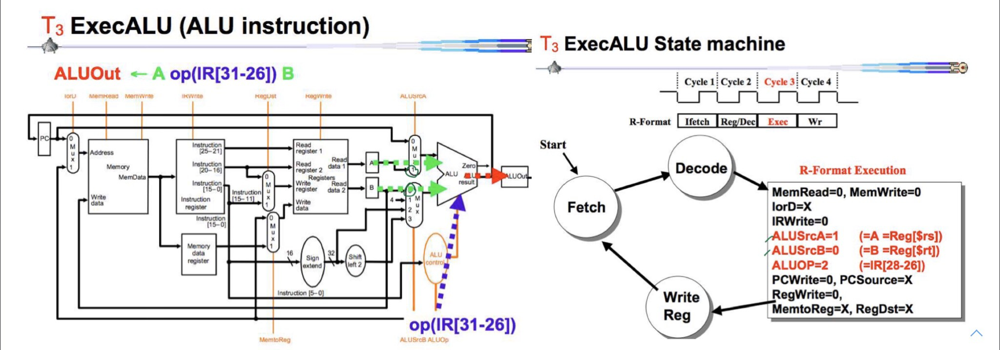

# Summary Report for CN210 : Computer Architecture
> หน้าเพจนี้จัดทำขึ้นเพื่อรวมรวมและสรุปเนื้อหาจากวิชา CN210 Computer Architecture ประจำปีการศึกษาที่ 2/2562

________________________________________________________________________________________________________________________________________

## HomeWork#1 - Jump Format (J-Format)

* **คลิปวีดีโอของการบ้านครั้งที่1**
> [Click Here for HomeWork#1 video](https://youtu.be/37fsqcEbHfk)

* **คำอธิบายเกี่ยวกับการบ้านครั้งที่1**


**Jump Format** มี 2 ส่วน


  ได้แก่
  1. **Op Code (Operation Code)** : มีความยาว *6 bits* และ สำหรับ J-Format จะใช้ Op Code คือ `000010`
  2. **Address (Jump Target Address)** : มีความยาว *26 bits* 
    * Note : ที่จริงแล้วใน สถาปัตยกรรมแบบ MIPs รหัสคำสั่งจะมีความยาว *32 bits* แต่จะต้องนำมาทำเป็น *26 bits* เพื่อใช้เป็น Address

________________________________________________________________________________________________________________________________________

**วิธีการแปลง *32 bits* เป็น *26 bits***

  เพื่อที่จะเข้าใจได้ง่ายขึ้นจึงยก**ตัวอย่าง**ประกอบการอธิบาย ดังนี้

  คำสั่ง `j 0xD0200080`  `pc=0xd0000040`  `opcode j=000010`

  นำ `D0200080` มาเขียนเป็น *เลขฐานสอง* จะได้ว่า

```
D0200080 = 1101 0000 0010 0000 0000 0000 1000 0000     //4บิตแรก(1101) และ 2บิตท้าย(00)ออก

         = 0000 1000 0000 1000 0000 0000 0010 0000     //ใส่opcode = 000010 ไปด้านหน้า
         
         = 0x0808020    //นำเลขฐาน2มาเปลี่ยนเป็นเลขฐาน16
```

**Note1 :** เหตุผลที่ทำการตัด4บิตแรก และ 2บิตท้ายออก คือ
1. ในMIPS Arcitechture มีรหัสความยาว *32 bits* หรือ *4 bytes* ซึ่งจะเป็น 4 เท่าไปเรื่อยๆ จึงทำให้ **2บิตท้ายของรหัส จะเป็น 00 เสมอ** จึงสามารถตัดออกได้
2. ใน4บิตแรก คือ **เลขที่มีนัยสำคัญสูงสุด** ซึ่งมีโอกาสน้อยมาที่ค่าจะเปลี่ยน จึงทำให้ 4บิตแรกของรหัส สามารถตัดออกได้

**Note2 :** เหตุผลที่เปลี่ยนเลขฐาน2 เป็นเลขฐาน16 คือ เพื่อการอ่านที่ง่ายกว่า

________________________________________________________________________________________________________________________________________


## HomeWork#2 - การทำงานของ CPU

* **คลิปวีดีโอของการบ้านครั้งที่2**
> [Click Here for HomeWork#2 video](https://youtu.be/GqOXGPJogCU)

* **คำอธิบายเกี่ยวกับการบ้านครั้งที่2**

   ยกตัวอย่าง ด้วยโค้ด `Test.java` ดังนี้
   ```java
   public class Test{
      public static void main(String[] args){
      int a = 10;
      int b = 20;
      int c = a + b;
      }
   }
   ```
   
   
   
**อธิบายการทำงานของ CPU**
   
**1.** CPU จะเริ่มทำงานที่ตำแหน่งที่ 0 (หรือ 00000000) ในตำแหน่งที่0 จะมีคำสั่ง `0840000` อยู่ เราจะนำมาเขียนเป็น เลขฐาน2 ได้ดังนี้
   ```
   0840000 = 0000 1000 0100 0000 0000 0000 0000
   ```
   
   และCPU จะเข้าไปดู 6บิตแรก ซึ่งก็คือ opcode ทำให้เรารู้ว่ารหัสนี้เป็นคำสั่งอะไร ซึ่งได้ออกมาเป็น `000010` เป็นคำสั่ง `Jump`
   
   จากนั้นนำเลขที่เหลือด้านหลังมาเติม **0000** เข้าไปด้านหน้า และ **00** ต่อท้าย ได้ดังนี้
   ```
   0000 0001 0000 0000 0000 0000 0000
   ```
   นำเลขฐาน2ที่ได้มา มาเขียนเป็นเลขฐาน16 ได้ดังนี้ `0100000`
   
   ทำให้ CPU รู้ว่า Address ที่จะกระโดดไปทำงานต่อไปคือที่ตำแหน่ง **01000000**
   
   ________________________________________________________________________________________________________________________________
   
**2.** CPU กระโดดมาทำงานในตำแหน่งที่ 01000000 ในตำแหน่งนี้มีคำสั่ง `8C090004` อยู่ ทำเป็นเลขฐาน2 ได้ดังนี้
   ```
   8C090004 = 1000 1100 0000 1001 0000 0000 0000 0100
   ```
   
   และCPU จะเข้าไปดู opcode ที่6บิตแรก ซึ่งก็คือ `100011` เป็นคำสั่ง `LW (หรือ Load Word)`
   
   จากนั้นจะเข้าไปดู 5บิตถัดไป คือ ***00000*** ซึ่งก็คือ rs = 0 และ ***01001*** ซึ่งก็คือ rt = 9
   
   และสุดท้ายคือ ส่วนที่เหลือ คือ ***0000000000000100*** ซึ่งก็คือ offset = 4
   
   คำสั่งload word จะทำการ ดึงข้อมูลจาก register ที่ rs+offset = 0+4 = 4 ซึ่งก็คือไปนำข้อมูลมาจากตำแหน่ง `00000004` 
   
   ไปเก็บใน register ที่ 9 หรือ `1A000000`
   
   ________________________________________________________________________________________________________________________________
   
   **3.** CPU ลงมาทำงานในตำแหน่งต่อไป คือตำแหน่งที่ 01000004 ในตำแหน่งนี้มีคำสั่ง `8d210000` อยู่ ทำเป็นเลขฐาน2 ได้ดังนี้
   ```
   8d210000 = 1000 1101 0010 0001 0000 0000 0000 0000
   ```
    
   และCPU เข้าไปดู opcode ที่6บิตแรก ซึ่งก็คือ `100011` เป็นคำสั่ง `LW (หรือ Load Word)`
   
   จากนั้นจะเข้าไปดู 5บิตถัดไป คือ ***01001*** ซึ่งก็คือ rs = 9 และ ***00001*** ซึ่งก็คือ rt = 1
   
   และสุดท้ายคือ ส่วนที่เหลือ คือ ***0000000000000000*** ซึ่งก็คือ offset = 0
   
   คำสั่งload word จะทำการ ดึงข้อมูลจาก register ที่ rs+offset = 9+0 = 0 ซึ่งก็คือไปนำข้อมูลมาจากตำแหน่ง `1A000000` 
   
   ไปเก็บใน `register ที่ 1`
   
   ดังนั้น ตอนนี้ที่ register 1 มีค่า 0000000A หรือ 10 ที่ในโปรแกรม Test.java ระบุค่าให้ตัวแปร int a เท่ากับ 10 นั่นเอง
   
   ________________________________________________________________________________________________________________________________
   
   **4.** CPU ลงมาทำงานในตำแหน่งถัดไป คือตำแหน่งที่ 01000008 ในตำแหน่งนี้มีคำสั่ง `8D220004` อยู่ ทำเป็นเลขฐาน2 ได้ดังนี้
   ```
   8D220004 = 1000 1101 0010 0010 0000 0000 0000 0100
   ```
   
   และCPU เข้าไปดู opcode ที่6บิตแรก ซึ่งก็คือ `100011` เป็นคำสั่ง `LW (หรือ Load Word)`
   
   จากนั้นจะเข้าไปดู 5บิตถัดไป คือ ***01001*** ซึ่งก็คือ rs = 9 และ ***00010*** ซึ่งก็คือ rt = 2
   
   และสุดท้ายคือ ส่วนที่เหลือ คือ ***0000000000000100*** ซึ่งก็คือ offset = 4
   
   คำสั่งload word จะทำการ ดึงข้อมูลจาก register ที่ rs+offset = 9+4 = 13 ซึ่งก็คือไปนำข้อมูลมาจากตำแหน่ง `1A000004` 
   
   ไปเก็บใน `register ที่ 2`
   
   ดังนั้น ตอนนี้ที่ register 2 มีค่า 00000014 หรือ 20 ที่ในโปรแกรม Test.java ระบุค่าให้ตัวแปร int b เท่ากับ 20 นั่นเอง
   
   ________________________________________________________________________________________________________________________________
   
   **5.** CPU ลงมาทำงานในตำแหน่งถัดไป คือตำแหน่งที่ 0100000C ในตำแหน่งนี้มีคำสั่ง `00221820` อยู่ ทำเป็นเลขฐาน2 ได้ดังนี้
   ```
   00221820 = 0000 0000 0010 0010 0001 1000 0010 0000
   ```
   
   และCPU เข้าไปดู opcode ที่6บิตแรก ซึ่งก็คือ `000000` เป็นคำสั่ง `R-Type`
   
   จากนั้นจะเข้าไปดู 5บิตถัดไป คือ ***00001*** ซึ่งก็คือ rs = 1 และ ***00010*** ซึ่งก็คือ rt = 2 และ ***00011*** ซึ่งก็คือ rd = 3
   
   และไปดูส่วน6บิตสุดท้ายจะรู้ว่า จะคำนวณโดยใช้operatorตัวใด ซึ่งจะได้ `100000` เป็น `add` 
   
   พอถอดรหัสได้แล้ว CPU จะทำการนำค่าใน register ที่ 1 มา add กับ register ที่ 2 แล้วเก็บค่าไว้ใน register ที่ 3
   
   ซึ่งจะได้ 10 + 20 = 30 จะได้ค่า 30 หรือ `0000001E` ไปเก็บไว้ที่ `register ที่ 3`
   
   ________________________________________________________________________________________________________________________________
   
   **6.**  CPU ลงมาทำงานในตำแหน่งถัดไป คือตำแหน่งที่ 01000010 ในตำแหน่งนี้มีคำสั่ง `AD230008` อยู่ ทำเป็นเลขฐาน2 ได้ดังนี้
   ```
   AD230008 = 1010 1101 0010 0011 0000 0000 0000 1000
   ```
   
   และCPU เข้าไปดู opcode ที่6บิตแรก ซึ่งก็คือ `101011` เป็นคำสั่ง `SW (หรือ Store Word)`
   
   จากนั้นจะเข้าไปดู 5บิตถัดไป คือ ***01001*** ซึ่งก็คือ rs = 9 และ ***00011*** ซึ่งก็คือ rt = 3
   
   และสุดท้ายคือ ส่วนที่เหลือ คือ ***0000000000001000*** ซึ่งก็คือ offset = 8
   
   คำสั่ง store word จะนำค่าจาก register ที่ 3 ไปเก็บไว้ที่ registerที่ rs+offset = 9+8 = 17 หรือ ตำแหน่ง 1A000008
   
   ดังนั้น ตอนนี้ในตำแหน่ง `1A000008` ก็มีค่า `0000001E` หรือ `30` นั่นเอง
   
   และจบการทำงานของCPU จากการทำตามโปรแกรม Test.java
   
   ________________________________________________________________________________________________________________________________
   
   

## HomeWork#3 - ความแตกต่างระหว่างSingle Cycle และ Multi Cycle
* **คลิปวีดีโอของการบ้านครั้งที่3**
> [Click Here for HomeWork#3 video](https://youtu.be/lq8xdIlsqn4)

* **คำอธิบายเกี่ยวกับการบ้านครั้งที่3**


________________________________________________________________________________________________________________________________

## HomeWork#4 - LW (Load Word) on Multi Cycle
* **คลิปวีดีโอของการบ้านครั้งที่4**
>[Click Here for HomeWork#4 video](https://youtu.be/D0uVYcWArPU)

* **คำอธิบายเกี่ยวกับการบ้านครั้งที่4**

Load Word มี 5ขั้นตอน


**1. T1 - Instruction Fetch**
  * ดึงข้อมูลจาก Memory ในตำแหน่ง PC ไปเก็บใน Instruction Register
  * และส่งPCไปที่ ALU เพื่อไปบวกกับ4 และส่งค่ากลับมาที่ PC เพื่อเก็บค่าของตำแหน่งที่จะทำงานตำแหน่งถัดไป
  


**2. T2 - Instruction Decode & Register Fetch**
  * นำค่าจากInstruction Register ไปใส่ไว้ใน A และ B
    * A -> Reg[IR[25-21]] และ B -> Reg[IR[20-16]]
  * นำค่า offset มาทำ sign extend จาก 16 bit เป็น 32 bit และทำการ shift ซ้าย 2ตำแหน่ง และ นำไปบวกกับค่า PC ที่ ALU และเก็บค่าไว้ที่ ALUOut
  


**3. T3 - Memory Address Calculation**
    * นำค่าที่เก็บใน A บวกกับ offset และ เก็บไว้ใน ALUOut
 
 
 
 **4. T4 - Memory Acess**
   * นำค่าในMemory ที่ตำแหน่งALUOut ไปเก็บที่ MDR(Memory Data Register)
 
 
 
 **5. T5 - Write-back Step**
   * นำค่าจาก MDR(Memory Data Register) ไปใส่ไว้ใน Reg[IR[20-16]] เป็นอันจบการทำงานของ Load Word
   
________________________________________________________________________________________________________________________________

## HomeWork#5 - Beq (Branch on Equal) on Multi Cycle
* **คลิปวีดีโอของการบ้านครั้งที่5**
> [Click Here for HomeWork#5 video](https://youtu.be/i2Pq82XXq5A)

* **คำอธิบายเกี่ยวกับการบ้านครั้งที่5**

Branch on Equal มี 3ขั้นตอน


**1. T1 - Instruction Fetch**
  * ดึงข้อมูลจาก Memory ในตำแหน่ง PC ไปเก็บใน Instruction Register
  * และส่งPCไปที่ ALU เพื่อไปบวกกับ4 และส่งค่ากลับมาที่ PC เพื่อเก็บค่าของตำแหน่งที่จะทำงานตำแหน่งถัดไป


**2. T2 - Instruction Decode & Register Fetch**
  * นำค่าจากInstruction Register ไปใส่ไว้ใน A และ B
    * A -> Reg[IR[25-21]] และ B -> Reg[IR[20-16]]
  * นำค่า offset มาทำ sign extend จาก 16 bit เป็น 32 bit และทำการ shift ซ้าย 2ตำแหน่ง และ นำไปบวกกับค่า PC ที่ ALU และเก็บค่าไว้ที่ ALUOut


**3. T3 - Branch Completion**
  * นำค่าที่เก็บไว้ใน A และ B ไปเปรียบเทียบว่า เท่ากันหรือไม่ ถ้าเท่ากัน ค่าที่เก็บไว้ในALUOut จากขั้นตอนที่แล้วจะถูกส่งไปที่ PC เพื่อไปในตำแหน่งต่อไป
  
________________________________________________________________________________________________________________________________


## HomeWork#6 - State Machine R-Format on Multi Cycle
* **คลิปวีดีโอของการบ้านครั้งที่6**
> [Click Here for HomeWork#6 video](https://youtu.be/G1lXcVCzqzM)

* **คำอธิบายเกี่ยวกับการบ้านครั้งที่6**


**1. T1 - Fetch**

1. **MemRead = 1** -- จะไปสั่งงานในส่วนMemory
    
2. **IorD = 1** -- จะนำค่า PC ไปใส่เป็น Memory Address
    
3. **IRWrite = 1** -- จะนำค่าที่ไปนำมาจาก Memory ในตำแหน่ง PC ไปใส่ไว้ใน Instruction Register
    
4. **ALUScrA = 0** -- จะส่งค่าPC ไปที่ Mux 
    
5. **ALUScrB = 1** -- Mux อีกตัวจะรับค่า4เข้ามา
    
6. **ALUOP = ADD** -- จะสั่งให้ นำค่า PC มาบวกกับ 4 และส่งผลไปที่ ALUOut
    
7. **PCSource = 1** -- จะส่งค่าจากALUOut ไปที่ Mux
    
8. **PCWrite = 1** -- จะส่งค่าPC+4 ไปที่ PC


**2. T2 - Decode**

จะนำค่า $rs ไปเก็บที่ Register A และ $rt ไปเก็บที่ Register B
  * A -> Reg[IR[25-21]] และ B -> Reg[IR[20-16]]
  
1.**ALUScrA = 0** -- จะนำค่าPCมาที่Mux
    
2.**ALUScrB = 3** -- จะนำค่า offsetมาที่Mux
    
3.**ALUOP = 0** -- จะทำการadd ค่าPC กับ offset และไปเก็บที่ ALUOut
 
 
 
 
 **3. T3 - ExecALU**
 
1.**ALUScrA = 1** -- นำค่า A ที่เก็บไว้ ส่งผ่านไปที่ Mux เตรียมคำนวณตามคำสั่ง
     
2.**ALUScrB = 0** -- นำค่า B ที่เก็บไว้ ส่งผ่านไปที่ Mux เตรียมคำนวณตามคำสั่ง
     
3.**ALUOP = 2** -- เป็นคำสั่งที่ต้องการจะคำนวณ เมื่อคำนวณเสร็จแล้วจะเก็บค่าไว้ที่ ALUOut
     
 
 
 **4. T4 - WrReg**
 
1.**MemtoReg = 0** -- จะดึงค่าจากALUOut ผ่านทาง Mux
     
2.**RegDst = 1** -- จะนำตัว register rd มารอรับข้อมูลจาก ALUOut
     
3.**RegWrite = 1** -- นำค่าALUOut ไปเก็บใน register rd ที่มารอรับข้อมูล
     
  
________________________________________________________________________________________________________________________________

## HomeWork#7 - Pipelining
* **คลิปวีดีโอของการบ้านครั้งที่7**
> [Click Here for HomeWork#7 video](https://youtu.be/J2nr4AUF03M)

* **คำอธิบายเกี่ยวกับการบ้านครั้งที่7**

**Pipelining** คือ การนำคำสั่งหลายๆคำสั่งมาทำงานพร้อมกัน โดยที่ไม่ต้องรอจนกว่าคำสั่งก่อนหน้าจะทำงานเสร็จ

ยกตัวอย่างเพื่อให้เข้าใจได้ง่ายขึ้น คือ การซักผ้า

ในการซักผ้า มีคน4คน แต่ละคนมีผ้า4ถุง

โดยมีขั้นตอนและเวลาแต่ละขั้นตอนดังนี้

```
1. นำไปซักในเครื่อซักผ้า 30นาที

2. นำไปอบในเครื่องอบผ้า 30นาที

3. นำผ้ามาพับ 30นาที

4. นำผ้าไปเก็บในลิ้นชัก 30นาที
```

ถ้าเราทำเป็นลำดับขั้นตอน

จะได้ดังนี้


ถ้าเราซักผ้าทีละคน จะใช้เวลาไปทั้งหมด 8ชั่วโมง ในการซักผ้าเพียง 4ถุง ซึ่งใช้เวลาเยอะมากๆ


ถ้าเราใช้การpipeline มาประยุกต์ใช้ในการซักผ้า จะทำให้ประหยัดเวลาไปเยอะมาก ทำให้ใช้เวลาไปเพียง 3.5 ชั่วโมง

```
เพราะเมื่อคนที่1 ซักผ้าเสร็จ และเอาผ้าไปอบในเครื่องอบผ้า คนที่2 ก็สามารถนำผ้าของตัวเองมาซักได้เลย พอคนที่2 ทำการซักผ้าเสร็จ และ 

นำผ้าไปอบในเครื่องอบที่คนที่1ใช้งานเสร็จแล้ว คนที่3ก็นำผ้าของตัวเองมาซักในเครื่องซักผ้าที่ว่างหลังจากคนที่2ซักผ้าเสร็จแล้ว 

แล้วก็จะเกิดขึ้นเป็นลักษณะนี้ไปเรื่อยๆจนทำงานเสร็จทุกคำสั่ง
```

เมื่อเรานำ**Single Cycle, Multi Cycle และ pipelining** มาเปรียบเทียบกันจะเป็นดังนี้


เราจะเห็นได้ว่า Single Cycle และ Multi Cycle จะใช้เวลานานกว่า pipelining เป็นอย่างมาก

```
pipelining จะทำคำสั่ง Load ก่อน เมื่อทำขั้นตอน Instruction fetch เสร็จแล้ว จะไปทำขั้นตอน Register ต่อ 

ในขณะเดียวกัน คำสั่งถัดมา คือ Store จะเข้ามาทำขั้นตอน Instruction Fetch ที่ว่างอยู่ได้ และเมื่อทำเสร็จ คำสั่ง Store จะทำขั้นตอน Register ต่อ 

ในขณะเดียวกัน คำสั่ง R-Type จะเข้ามาทำขั้นตอน Instruction Fetch ที่ว่างอยู่และจะทำลักษณะนี้ไปเรื่อยจนกว่าจะทำงานเสร็จทุกขั้นตอน 

ทำให้การpipelining ใช้เวลาน้อยกว่า Single Cycle และ Multi Cycle
```

**แล้ว pipelining มีปัญหาเกิดขึ้นบ้างหรือไม่?**

**คำตอบคือ มี และแบ่งได้เป็น 3ประเภท**

1.ปัญหาเชิงโครงสร้าง : เกิดขึ้นเมื่อใช้อุปกรณ์ตัวเดียวกัน จึงทำให้ขั้นตอนสองขั้นตอนชนกัน

2.ปัญหาเชิงข้อมูล : บางทีคำสั่งที่ทำงานต่อๆกันมาต้องการข้อมูลของคำสั่งก่อนหน้า แต่คำสั่งก่อนหน้ายังทำงานไม่เสร็จเลยทำให้เกิดปัญหาขึ้น

3.ปัญหาเชิงการควบคุม : 


**ซึ่งปัญหาที่เกิดขึ้นสามารถแก้ได้โดย การรอ**

**ตัวอย่างวิธีแก้ปัญหาpipelining**

**Load Forwarding**


```
คำสั่ง LW $s0 เป็นค่าที่จะเกิดขึ้นหลังจากทำคำสั่งLW เสร็จแล้ว

แต่ว่ามีคำสั่ง sub ที่ต้องการใช้ค่า $s0 แต่ว่า LW ยังทำงานไม่เสร็จ ค่า$s0 เลยยังไม่พร้อมให้ใช้

จึงมีการทำ Load Forwarding คือโยนค่า $s0ที่คำนวณเสร็จแล้ว (ถึงแม้จะยังไม่ได้นำไปเก็บเสร็จเรียบร้อยก็ตาม) 

ส่งไปให้คำสั่งถัดไปที่ต้องการใช้ $s0 ซึ่งก็คือ คำสั่ง sub นั่นเอง
```

**Reordering**


เป็นการเรียงลำดับคำสั่งใหม่เพื่อไม่ให้เกิดปัญหา

```
ในที่นี้lw $t2,4($t1) ที่บรรทัดที่2 อยู่ติดกับ sw $t2, 0($t1) ที่บรรทัดที่3 ทำให้เกิดปัญหา

จึงทำการเปลี่ยน lw $t2,4($t1) ไปอยู่บรรทัดที่1 ซึ่งทำให้กว่าจะถึง คำสั่ง sw $t2, 0($t1) 

คำสั่งlw $t2,4($t1)ก็ทำงานเสร็จเรียบร้อยแล้ว จึงทำให้ไม่เกิดปัญหาขึ้น
```

________________________________________________________________________________________________________________________________
